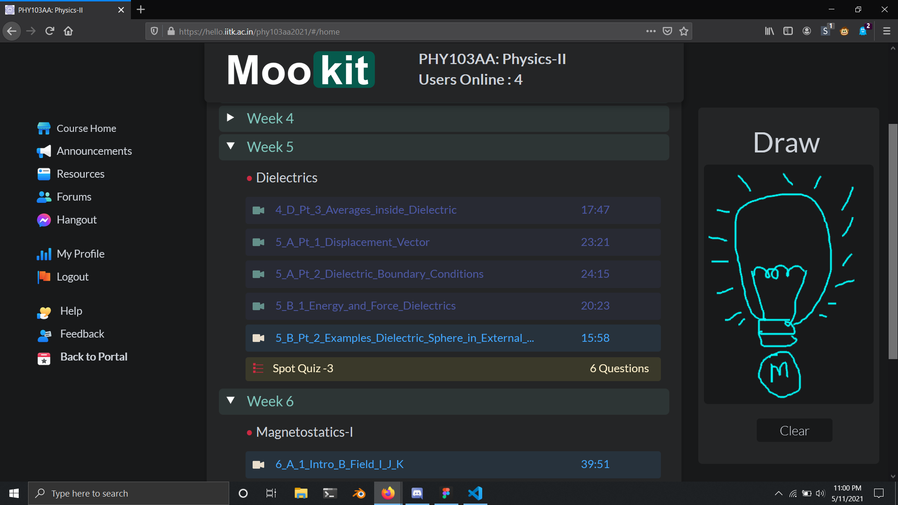

# mentosMookit
---

### New ui for Mookit by forcing custom css and js by use of browser extensions

## Setup
* ### For Firefox
    - [**Stylebot** Extension](https://addons.mozilla.org/en-US/firefox/addon/stylebot-web/)
        - Browse to any course page on Mookit. Open stylebot and copy the contents of [main.css](./css/main.css) file in editor window.

    - [**Greasemonkey Extension**](https://addons.mozilla.org/en-US/firefox/addon/greasemonkey/)
        - Browse to any course page on Mookit. Open Greasemonkey, create two new scripts and paste the contents of [icons.js](./js/icons.js) and [drawpad.js](./js/drawpad.js) in those scripts and save.

* ### For Chrome
    - [**Stylebot** Extension](https://chrome.google.com/webstore/detail/stylebot/oiaejidbmkiecgbjeifoejpgmdaleoha)
        - Browse to any course page on Mookit. Open stylebot and copy the contents of [main.css](./css/main.css) file in editor window.

    - [**Violentmonkey**](https://chrome.google.com/webstore/detail/violentmonkey/jinjaccalgkegednnccohejagnlnfdag)
        - Step similar to that of Greasemonkey

## Screenshots

---